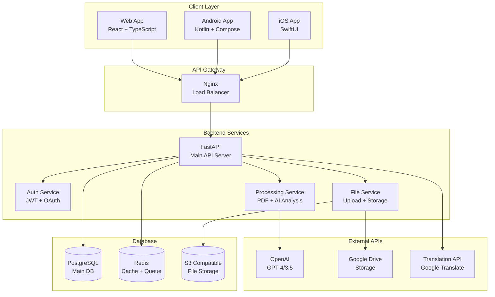
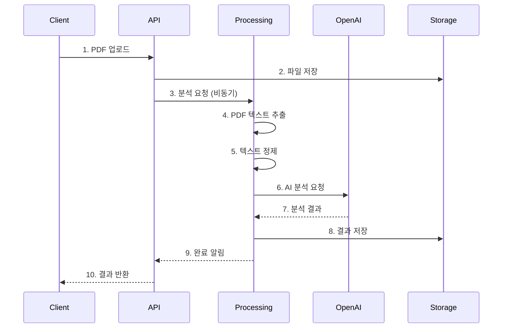

# HanDoc AI 아키텍처 설계

## 🏗️ 전체 시스템 아키텍처

### 1. 마이크로서비스 아키텍처



### 2. 데이터 플로우



## 🔧 백엔드 아키텍처

### 1. FastAPI 구조

```
backend/
├── app/
│   ├── __init__.py
│   ├── main.py                 # FastAPI 앱 진입점
│   ├── api/                    # API 라우터
│   │   ├── __init__.py
│   │   ├── v1/
│   │   │   ├── __init__.py
│   │   │   ├── analyze.py      # 문서 분석 API
│   │   │   ├── auth.py         # 인증 API
│   │   │   ├── files.py        # 파일 관리 API
│   │   │   └── users.py        # 사용자 관리 API
│   │   └── deps.py             # 의존성 주입
│   ├── core/                   # 핵심 설정
│   │   ├── __init__.py
│   │   ├── config.py           # 환경 설정
│   │   ├── security.py         # 보안 설정
│   │   └── database.py         # DB 연결
│   ├── models/                 # 데이터 모델
│   │   ├── __init__.py
│   │   ├── user.py             # 사용자 모델
│   │   ├── document.py         # 문서 모델
│   │   └── analysis.py         # 분석 결과 모델
│   ├── schemas/                # Pydantic 스키마
│   │   ├── __init__.py
│   │   ├── user.py
│   │   ├── document.py
│   │   └── analysis.py
│   ├── services/               # 비즈니스 로직
│   │   ├── __init__.py
│   │   ├── pdf_processor.py    # PDF 처리
│   │   ├── ai_analyzer.py      # AI 분석
│   │   ├── text_cleaner.py     # 텍스트 정제
│   │   ├── file_manager.py     # 파일 관리
│   │   └── export_service.py   # 결과 내보내기
│   ├── utils/                  # 유틸리티
│   │   ├── __init__.py
│   │   ├── logger.py           # 로깅
│   │   ├── exceptions.py       # 예외 처리
│   │   └── helpers.py          # 헬퍼 함수
│   └── tests/                  # 테스트
│       ├── __init__.py
│       ├── test_api/
│       ├── test_services/
│       └── conftest.py
├── requirements.txt
├── Dockerfile
└── docker-compose.yml
```

### 2. 데이터베이스 스키마

```sql
-- 사용자 테이블
CREATE TABLE users (
    id UUID PRIMARY KEY DEFAULT gen_random_uuid(),
    email VARCHAR(255) UNIQUE NOT NULL,
    username VARCHAR(100) UNIQUE NOT NULL,
    hashed_password VARCHAR(255) NOT NULL,
    is_active BOOLEAN DEFAULT true,
    is_premium BOOLEAN DEFAULT false,
    created_at TIMESTAMP DEFAULT CURRENT_TIMESTAMP,
    updated_at TIMESTAMP DEFAULT CURRENT_TIMESTAMP
);

-- 문서 테이블
CREATE TABLE documents (
    id UUID PRIMARY KEY DEFAULT gen_random_uuid(),
    user_id UUID REFERENCES users(id) ON DELETE CASCADE,
    filename VARCHAR(255) NOT NULL,
    original_filename VARCHAR(255) NOT NULL,
    file_size INTEGER NOT NULL,
    file_path VARCHAR(500) NOT NULL,
    mime_type VARCHAR(100) NOT NULL,
    status VARCHAR(50) DEFAULT 'uploaded', -- uploaded, processing, completed, failed
    created_at TIMESTAMP DEFAULT CURRENT_TIMESTAMP,
    updated_at TIMESTAMP DEFAULT CURRENT_TIMESTAMP
);

-- 분석 결과 테이블
CREATE TABLE analyses (
    id UUID PRIMARY KEY DEFAULT gen_random_uuid(),
    document_id UUID REFERENCES documents(id) ON DELETE CASCADE,
    raw_text TEXT,
    cleaned_text TEXT,
    summary TEXT,
    keywords JSONB,
    qa_pairs JSONB,
    important_sentences JSONB,
    processing_time INTEGER, -- 처리 시간 (초)
    ai_model VARCHAR(50), -- gpt-4, gpt-3.5-turbo 등
    language VARCHAR(10) DEFAULT 'ko',
    created_at TIMESTAMP DEFAULT CURRENT_TIMESTAMP
);

-- 내보내기 기록 테이블
CREATE TABLE exports (
    id UUID PRIMARY KEY DEFAULT gen_random_uuid(),
    analysis_id UUID REFERENCES analyses(id) ON DELETE CASCADE,
    export_type VARCHAR(50) NOT NULL, -- markdown, pdf, txt, gdrive
    export_path VARCHAR(500),
    export_url VARCHAR(500),
    created_at TIMESTAMP DEFAULT CURRENT_TIMESTAMP
);

-- 사용자 피드백 테이블
CREATE TABLE feedback (
    id UUID PRIMARY KEY DEFAULT gen_random_uuid(),
    user_id UUID REFERENCES users(id) ON DELETE SET NULL,
    analysis_id UUID REFERENCES analyses(id) ON DELETE SET NULL,
    rating INTEGER CHECK (rating >= 1 AND rating <= 5),
    comment TEXT,
    feedback_type VARCHAR(50), -- quality, speed, accuracy, ui
    created_at TIMESTAMP DEFAULT CURRENT_TIMESTAMP
);

-- 인덱스 생성
CREATE INDEX idx_documents_user_id ON documents(user_id);
CREATE INDEX idx_documents_status ON documents(status);
CREATE INDEX idx_analyses_document_id ON analyses(document_id);
CREATE INDEX idx_exports_analysis_id ON exports(analysis_id);
CREATE INDEX idx_feedback_user_id ON feedback(user_id);
```

## 🎨 프론트엔드 아키텍처

### 1. React 앱 구조

```
frontend/
├── public/
│   ├── index.html
│   ├── manifest.json
│   └── locales/               # 다국어 파일
│       ├── ko/
│       │   └── common.json
│       └── en/
│           └── common.json
├── src/
│   ├── components/            # 재사용 컴포넌트
│   │   ├── common/
│   │   │   ├── Button.tsx
│   │   │   ├── Input.tsx
│   │   │   ├── Modal.tsx
│   │   │   └── Loading.tsx
│   │   ├── layout/
│   │   │   ├── Header.tsx
│   │   │   ├── Footer.tsx
│   │   │   └── Sidebar.tsx
│   │   └── upload/
│   │       ├── DropZone.tsx
│   │       ├── FileList.tsx
│   │       └── ProgressBar.tsx
│   ├── pages/                 # 페이지 컴포넌트
│   │   ├── Home.tsx
│   │   ├── Upload.tsx
│   │   ├── Analysis.tsx
│   │   ├── Results.tsx
│   │   └── Profile.tsx
│   ├── hooks/                 # 커스텀 훅
│   │   ├── useAuth.ts
│   │   ├── useUpload.ts
│   │   ├── useAnalysis.ts
│   │   └── useLocalStorage.ts
│   ├── store/                 # 상태 관리 (Zustand)
│   │   ├── authStore.ts
│   │   ├── uploadStore.ts
│   │   ├── analysisStore.ts
│   │   └── uiStore.ts
│   ├── services/              # API 서비스
│   │   ├── api.ts
│   │   ├── auth.ts
│   │   ├── upload.ts
│   │   └── analysis.ts
│   ├── utils/                 # 유틸리티
│   │   ├── constants.ts
│   │   ├── helpers.ts
│   │   ├── validation.ts
│   │   └── formatters.ts
│   ├── types/                 # TypeScript 타입
│   │   ├── api.ts
│   │   ├── user.ts
│   │   └── document.ts
│   ├── styles/                # 스타일
│   │   ├── globals.css
│   │   └── components.css
│   ├── App.tsx
│   ├── index.tsx
│   └── i18n.ts               # 다국어 설정
├── package.json
├── tailwind.config.js
├── tsconfig.json
└── Dockerfile
```

### 2. 상태 관리 구조 (Zustand)

```typescript
// store/authStore.ts
interface AuthState {
  user: User | null;
  token: string | null;
  isAuthenticated: boolean;
  login: (email: string, password: string) => Promise<void>;
  logout: () => void;
  register: (userData: RegisterData) => Promise<void>;
}

// store/uploadStore.ts
interface UploadState {
  files: File[];
  uploadProgress: Record<string, number>;
  isUploading: boolean;
  addFiles: (files: File[]) => void;
  removeFile: (fileId: string) => void;
  uploadFiles: () => Promise<void>;
}

// store/analysisStore.ts
interface AnalysisState {
  currentAnalysis: Analysis | null;
  analysisHistory: Analysis[];
  isAnalyzing: boolean;
  startAnalysis: (documentId: string) => Promise<void>;
  getAnalysisResult: (analysisId: string) => Promise<void>;
}
```

## 📱 모바일 아키텍처

### 1. Android (Kotlin + Jetpack Compose)

```
android/
├── app/
│   ├── src/
│   │   ├── main/
│   │   │   ├── java/com/handoc/ai/
│   │   │   │   ├── ui/
│   │   │   │   │   ├── theme/
│   │   │   │   │   ├── components/
│   │   │   │   │   ├── screens/
│   │   │   │   │   └── navigation/
│   │   │   │   ├── data/
│   │   │   │   │   ├── repository/
│   │   │   │   │   ├── network/
│   │   │   │   │   └── local/
│   │   │   │   ├── domain/
│   │   │   │   │   ├── model/
│   │   │   │   │   ├── repository/
│   │   │   │   │   └── usecase/
│   │   │   │   ├── presentation/
│   │   │   │   │   └── viewmodel/
│   │   │   │   └── di/
│   │   │   └── res/
│   │   └── test/
│   ├── build.gradle
│   └── proguard-rules.pro
├── build.gradle
└── settings.gradle
```

### 2. iOS (SwiftUI)

```
ios/
├── HanDocAI/
│   ├── App/
│   │   ├── HanDocAIApp.swift
│   │   └── ContentView.swift
│   ├── Core/
│   │   ├── Network/
│   │   ├── Storage/
│   │   └── Utils/
│   ├── Features/
│   │   ├── Upload/
│   │   ├── Analysis/
│   │   ├── Results/
│   │   └── Profile/
│   ├── Shared/
│   │   ├── Components/
│   │   ├── Models/
│   │   └── Extensions/
│   └── Resources/
│       ├── Localizable.strings
│       └── Assets.xcassets
├── HanDocAITests/
└── HanDocAI.xcodeproj
```

## 🔄 CI/CD 파이프라인

### GitHub Actions 워크플로우

```yaml
# .github/workflows/backend.yml
name: Backend CI/CD
on:
  push:
    branches: [main, develop]
    paths: ['backend/**']
  pull_request:
    branches: [main]
    paths: ['backend/**']

jobs:
  test:
    runs-on: ubuntu-latest
    steps:
      - uses: actions/checkout@v3
      - name: Set up Python
        uses: actions/setup-python@v4
        with:
          python-version: '3.11'
      - name: Install dependencies
        run: |
          cd backend
          pip install -r requirements.txt
      - name: Run tests
        run: |
          cd backend
          pytest
      - name: Run linting
        run: |
          cd backend
          flake8 app/
          black --check app/

  deploy:
    needs: test
    runs-on: ubuntu-latest
    if: github.ref == 'refs/heads/main'
    steps:
      - name: Deploy to Railway
        run: |
          # Railway 배포 스크립트
```

## 🔒 보안 고려사항

### 1. 인증 및 권한
- JWT 토큰 기반 인증
- OAuth 2.0 소셜 로그인 지원
- API 키 관리 (OpenAI, Google Drive)
- 파일 업로드 크기 제한

### 2. 데이터 보호
- HTTPS 강제 사용
- 파일 암호화 저장
- 개인정보 마스킹
- GDPR 준수

### 3. API 보안
- Rate Limiting
- CORS 설정
- Input Validation
- SQL Injection 방지

## 📊 모니터링 및 로깅

### 1. 로깅 전략
- 구조화된 로깅 (JSON)
- 로그 레벨 관리
- 민감 정보 마스킹
- 중앙화된 로그 수집

### 2. 모니터링
- 애플리케이션 성능 모니터링 (APM)
- 에러 추적 (Sentry)
- 메트릭 수집 (Prometheus)
- 알림 시스템

### 3. 분석
- 사용자 행동 분석
- 성능 메트릭
- 비즈니스 메트릭
- A/B 테스트

이 아키텍처는 확장 가능하고 유지보수가 용이하도록 설계되었으며, 각 컴포넌트는 독립적으로 개발 및 배포할 수 있습니다.

